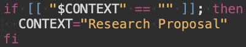
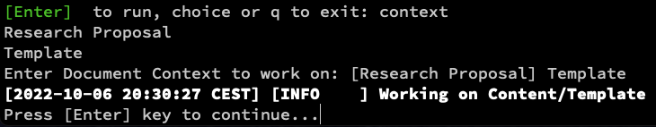
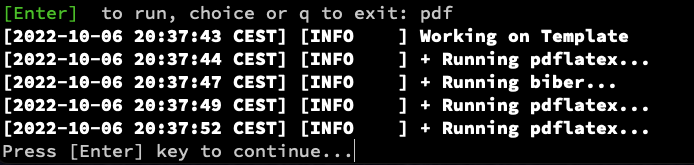
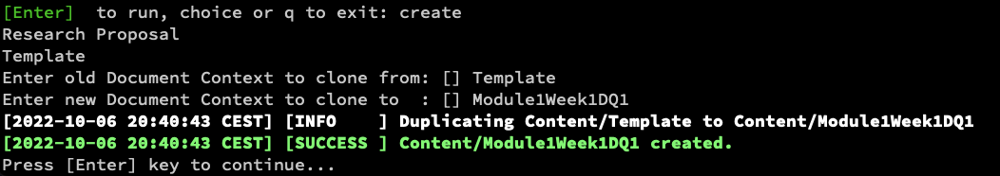
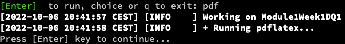
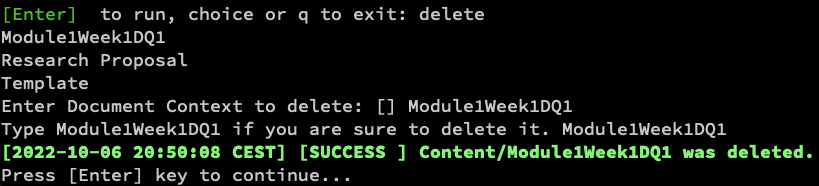

# Clone your own Template

By default, the `Content` directory contains two folders:

1. Research Proposal: This is some stuff I am writing
2. Template: A Template that you can use

These are all work contexts for the LaTeX shell.

The default context is configured within the `make.sh` script right at the top:




You can change that value there if you so want; alternatively, you can set the environment variable `CONTEXT` to some value that you may choose to use:

```bash
export CONTEXT=Template
./make.sh
```

Or, you can also choose the context like so:



## Try to Build the Template

Go into a shell (see [Basic Usage](Basic%20Usage.md)) and build the template. First, choose the template as work context (see above), and then just generate the pdf:



As you can see, the LaTeX shell will automatically find out what remains to be done, and repetitively call sub processes as needed.

If the process is successful, a PDF should be opened.

## Clone the Template

Any context can serve as a template for new work. So for example, if you want to clone the `Template` context to create space for some new work, just do this:



This new context will also automatically become the new working context:



Just remember that you choose the right working context if you restart the LaTeX shell using one of these options:

1. Use the `context` command inside the LaTeX shell
2. Set the `CONTEXT` environment variable
3. Change `make.sh` at the top, as shown above.

## Delete a Context

If you want to delete a Context, you can do this:



Note that you'll need to enter the name of the Context twice, in order to prevent accidential deletion.

