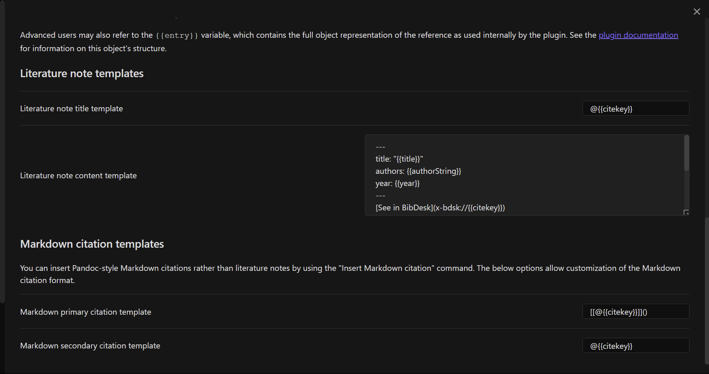
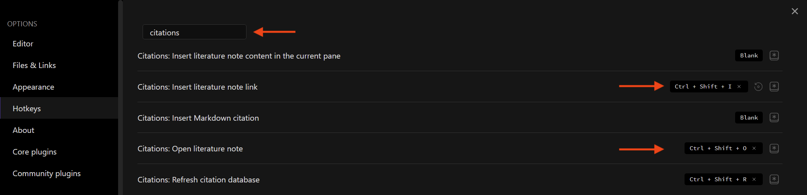
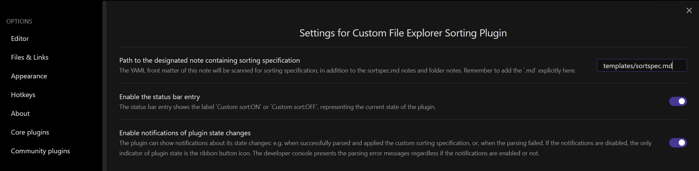
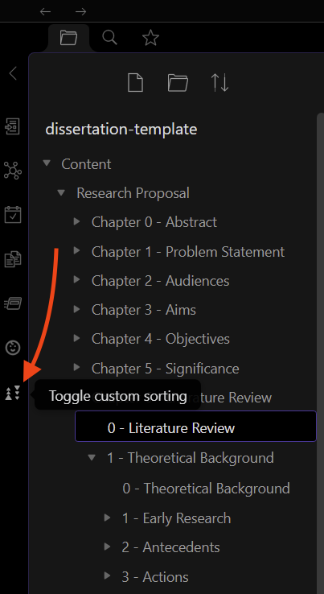

# Configure Obsidian for LaTeX

## Install Obisidan

Download and install Obsidian from [here](https://obsidian.md)

## Turn On Community Plugins

Go to Settings, and turn on community plugins.


## Install Citations Plugin

Go to Settings, Community Plugins, Browse, search for and install Citations Plugin.

Configure it as shown here (set the path to where ever you actually put the Bibliography file):





This is the template that I use for new citations notes:

```
{{authorString}}
year: {{year}}
---
[See in BibDesk](x-bdsk://{{citekey}})

#source

## Notes and Quotes
```

Note that the BibDesk link only really works under MacOS; this allows you to jump, from a given citation note, directly to the BibDesk entry in your bibliography.


## Configure Hotkeys
Open the Hotkeys configuration for Obsidian, filter for `citations` and set the hotkeys as marked below:




With that, you can

1. Use `Ctrl+Shift+I` to insert a citation
2. Use `Ctrl+Shift+O` to insert a reference note


## Install Custom File Sorting Plugin

Obsidian sorts files always after foldes. This is annoying if you want to, e.g., have an overview file in a folder, like `0 - Overview`, and then a number of subfolders. The LaTeX shell will sort them correctly, but you would see a different order in Obsidian. To fix this, we install the sorting plugin.

### Installing the plugin using BRAT

1. Install the BRAT plugin
	1. Open `Settings` -> `Community Plugins`
	2. Disable restricted (formerly 'safe') mode, if enabled
	3. *Browse*, and search for "BRAT"
	4. Install the latest version of **Obsidian 42 - BRAT**
2. Open BRAT settings (`Settings` -> `Obsidian42 - BRAT`)
	1. Scroll to the `Beta Plugin List` section
	2. `Add Beta Plugin`
	3. Specify this repository: `SebastianMC/obsidian-custom-sort`
3. Enable the `Custom File Explorer sorting` plugin (`Settings` -> `Community Plugins`)

### Configuring the Plugin

Configure the plugin as follows:



Next, to activate the plugin, find the plugin section in the ribbon and click on it:




As you can see in the above screen shot, the `0 - Literature Review` document is shown *before* all following content even though that content is in subfolders.


## Install the Word Count Plugin

Use the community plugins installer option of Obsidian to install the Novel Word Count plugin; this will give you word counts right in the folder tree.