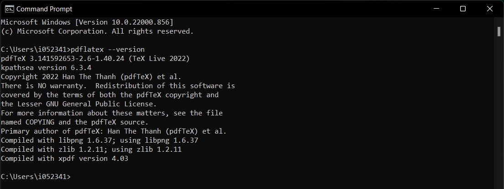
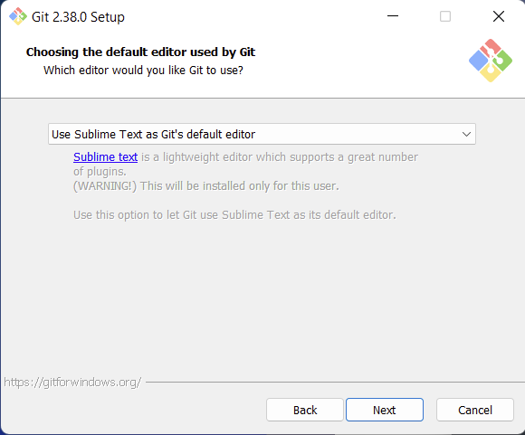
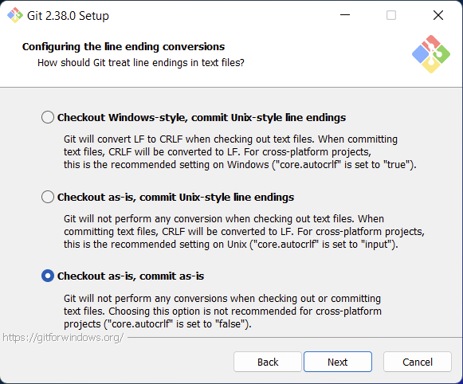
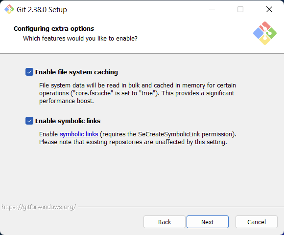
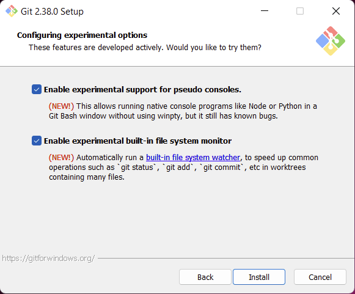
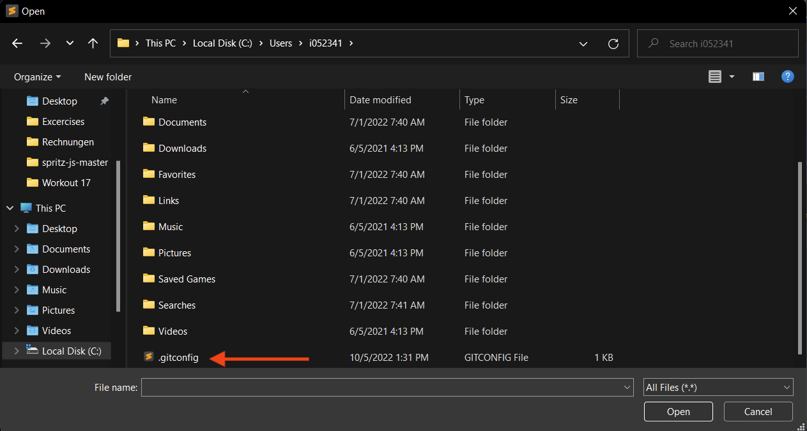
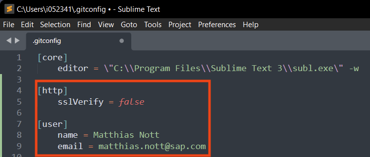
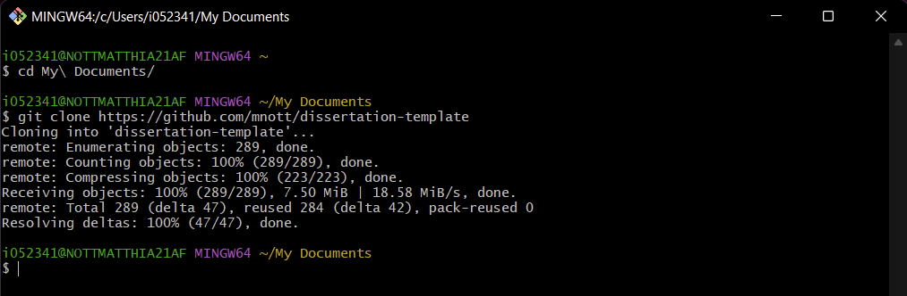

# Installation of LaTeX under Windows

## Install TeXLive

Install TeXLive from [here](https://tug.org/texlive/acquire-netinstall.html)

Test the installation like so:

```cmd
pdflatex --version
```




## Install Sublime Text

Download Sublime Text from [here](https://www.sublimetext.com/) Sublime Text is not strictly needed, but very useful.


## Install GitBash

Install Git Bash from [here](https://gitforwindows.org/)

Select "Add Git Bash Profile to Windows Terminal:"


Use Sublime Text as Git's default editor (or anything else should you so prefer):




Select "Checkout as-is, commit as-is":




Enable symbolic links:




Activate experimental options:




## Configure Git

Use Sublime Text or any other editor to edit the .gitconfig file in your home directory:




Add the http and user sections and configure accordingly:




Also, execute this command:

```bash
git config advice.addIgnoredFile false
```


## Clone the Dissertation Template

Open a GitBash shell and do this:




## Install Pandoc

The make script uses Pandoc for some of the parsing. 

Install Pandoc from [here](https://pandoc.org/installing.html).


## Install wget

Wget does not come with GitBash.

Download wget from [here](https://eternallybored.org/misc/wget/)

Open GitBash as Administrator and do this:

```bash
cd ~/Downloads
mkdir -p /usr/local/bin
mv wget.exe /usr/local/bin
ln -s /usr/bin/start /usr/bin/open
```

You need to be Administrator in order to move the wget executable to `/usr/local/bin` (and to create that directory in the first place). 

The last line above creates a symlink so that you'll have an `open` command available; `open` is the MacOS equivalent for the Windows `start`; the make script uses the `open` command to open e.g. a PDF in the system's default PDF viewer.


## Install some LaTeX Fonts

```bash
echo "check_certificate=off" >>~/.wgetrc
wget -q https://www.tug.org/fonts/getnonfreefonts/install-getnonfreefonts
texlua ./install-getnonfreefonts
getnonfreefonts.exe --sys -a
```


## Install Strawberry Perl

Go [here](https://strawberryperl.com/download/5.32.1.1/strawberry-perl-5.32.1.1-64bit.msi) and install Strawberry Perl.

Add Strawberry Perl to the PATH: Open a GitBash shell and do this:

```bash
echo 'export PATH=/c/Strawberry/perl/bin:$PATH' >>~/.bash_profile
```

Close the shell and re-open it.

## Install of Perl Modules

```bash
cpanm install DATA::Dump
```


## Install a PDF Viewer that does Auto-Refresh

Install SumatraPDF from [here](https://www.sumatrapdfreader.org/download-free-pdf-viewer)

## Install Jabref

Install Jabref from [here](https://jabref.org)


