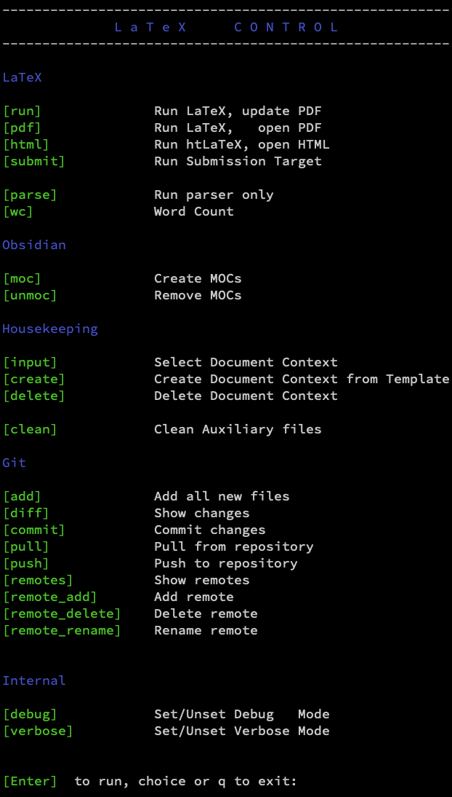

# dissertation-template
A LaTeX Template for Dissertations that works well with Obsidian.

# Installation

The installation is described [here](Documentation/README.md).

# Use

## The LaTeX Shell

Open a Bash shell (e.g., GitBash under Windows, if you followed the installation [here](Documentation/README.md)) and change into the directory into which you had cloned the dissertation template:

```bash
cd ~/My\ Documents/dissertation-template
```

Open the Make script:

```bash
./make.sh
```

This will give you a menu such as this:



See [Initial Steps](Documentation/Initial%20Steps.md) for the initial steps you need to do.


