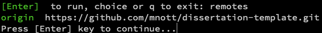
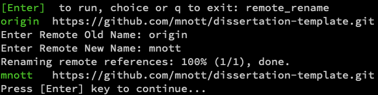
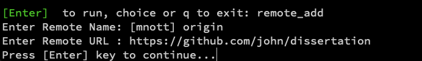
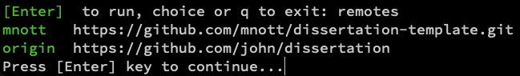
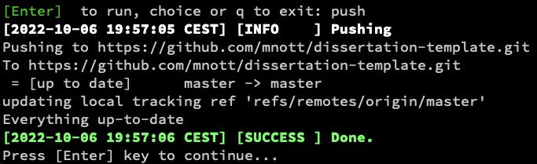

# dissertation-template
A LaTeX Template for Dissertations that works well with Obsidian.

# Installation

The installation is described [here](Documentation/Installation.md).

# Use

## The LaTeX Shell

Open a Bash shell (e.g., GitBash under Windows, if you followed the installation [here](Documentation/Installation.md)) and change into the directory into which you had cloned the dissertation template:

```bash
cd ~/My\ Documents/dissertation-template
```

Open the Make script:

```bash
./make.sh
```

This will give you a menu such as this:


## Initial Steps

The first thing you should do is to create your own directory.  Create your own blank Github repository; assuming your Github user name is `john` and your repository is `dissertation`, then do this within the `make.sh`script:

### List the currently defined Repositories

Enter `remotes` like so:



This shows you that there are currently one remote (`origin`) defined. If you have multiple remotes, the one you're going to use for a default  `git push` will always be the `origin` remote.

As there is already one named `origin`, you can delete or at least rename it:



Now you've made space to add your own repository:

### Add your own Repository

You'll add your own one like so:



If you list the remotes again, you can see your repository:



### Push to your own Repository



(I've renamed my repositories before doing the push, so that I could take the screen shot; yours would be similar).


